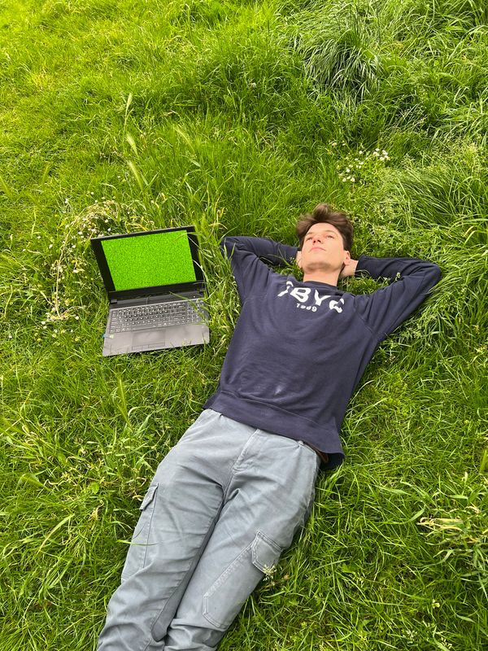

# Leo Scarin

**Email**: studio [at] leoscarin [dot] nl  
**Handle**: [@scarscarin](https://instagram.com/scarscarin)

**Leo Scarin** (he/him) is an artist and designer working with code.

Based in [RGBdog studio](https://rgbdog.studio), at [KG95](https://kg95.nl), in The Hague, Scarin's practice stretches across interactive media, moving image, and creative coding; intersecting disciplinary methods to research and problematise digital technology.

Scarin's work has been featured at [V2_Lab](https://v2.nl/people/leo-scarin), [The Hmm](https://thehmm.nl/speaker/leo-scarin/), [STRP](https://strp.nl/events/hybrid-infinities), [FIBER](https://www.fiber-space.nl/project/reassemble-lab-degrowing-infrastructures/), [AIxDesign](https://medium.com/aixdesign/meet-the-community-leo-scarin-7fa7604d550c), [iii](https://instrumentinventors.org/agenda/the-art-of-misusing-a-body-capture-algorithm-with-leo-scarin/), [IMPAKT](https://impakt.nl/events/2023/event/impakt-hybrid-wine-and-art-tasting-event/metaphysical-tastings/#), and more.

Scarin is a lecturer in Interactive / Media / Design at [KABK](https://www.kabk.nl/en/programmes/bachelor/interactive-media-design), in Moving Image at [ArtEZ](https://www.artez.nl/en/programmes/bachelor/moving-image-enschede), and at the Interaction Station in [WdKA](https://www.wdka.nl/stations/interaction-station).

