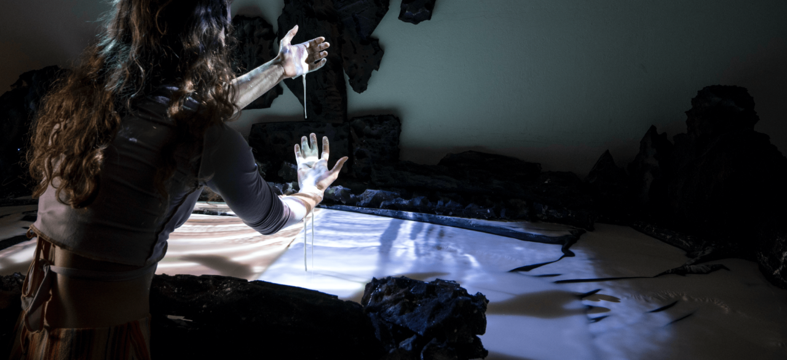

# Avalonia, Topographies of Impact

An interactive documentary on non-newtonian-fluid

**When**: 2022  
**Role**: Creative Technologist  
**With**: Cami Chebez  
**Context**: KABK Graduation 2022  
**Link**: [KABK Graduation Catalogue 2022](https://graduation.kabk.nl/2022/camila-chebez)

Along the mining region of the Ruhr in Germany, Camila Chebez encounters Avalonia: an abandoned sandstone quarry that has turned into a popular climbing crag. Sharing its name with a micro-drifting continent from the Palaeozoic era, this site beckons for a closer look at its porous textures, which archive a deep history of impacting surfaces:

Building upon the haptic qualities of the embodied practice of rock climbing, this work is an invitation to (re)explore an Earth too often figured as mute and inert, a wasteland in waiting. By playing with surfaces as a point of contact and projections as a collective memory, **Avalonia Topographies of Impact** puzzles together a narrative where ruins can become playgrounds for more-than-human encounters.

<iframe title="vimeo-player" src="https://player.vimeo.com/video/748484395?h=1f4accfab9" width="100%" height="360" frameborder="0" referrerpolicy="strict-origin-when-cross-origin" allow="autoplay; fullscreen; picture-in-picture; clipboard-write; encrypted-media; web-share"   allowfullscreen></iframe>
