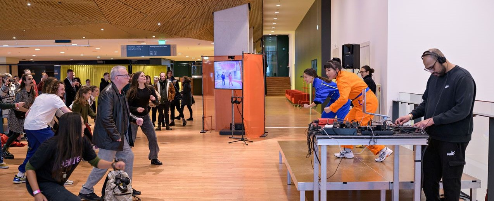
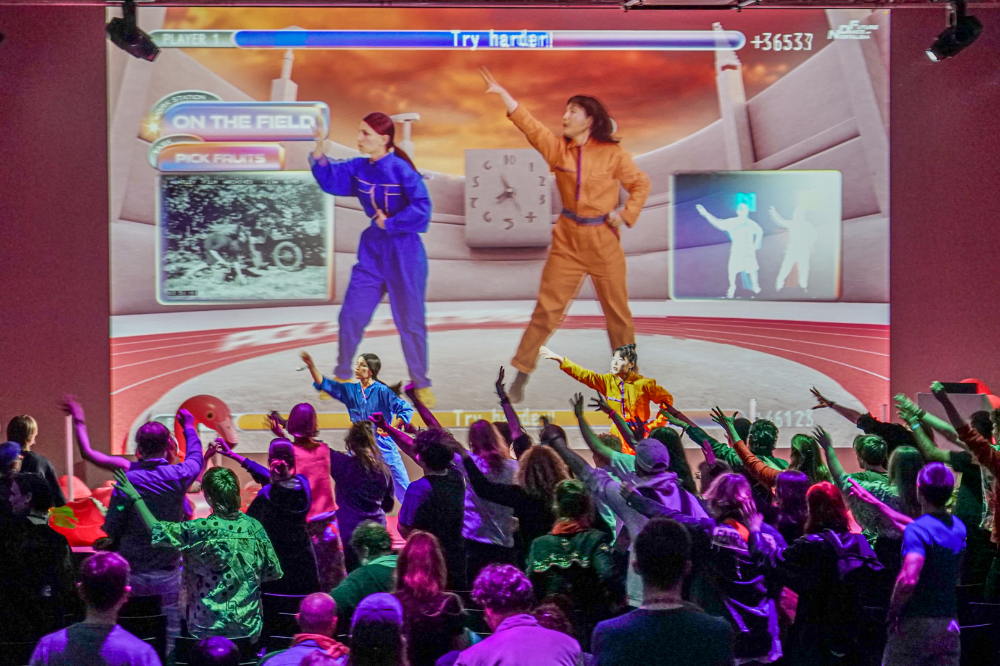
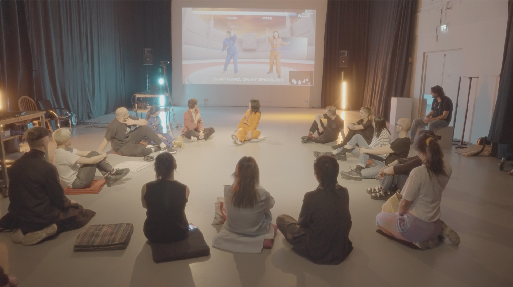

# Future Dance of Nostalgia

A videogame for Kexin Hao's performance on the choreographies of pre-industrial labour songs

**Link**: [Kexin Hao: Future Dance of Nostalgia](https://howkexin.com/project/future-dance-of-nostalgia_new.html)
**Role**: Creative Technologist
**When**: 2022

Commissioned by iii and directed by Kexin Hao, 'Future Dance of Nostalgia' explores ancient human activities of production in the form of an interactive dance game and as an investigation into the human body as an archive.

'Future Dance of Nostalgia' premiered at Proximity Music: Sensing After Thought, a collaboration between iii and Rewire during Rewire Festival 2022, and has toured since. This work was chosen by Gonzo Circus as one of their Top 10 highlights of Rewire Festival.

<iframe title="vimeo-player" src="https://player.vimeo.com/video/713650728?h=16c8b9bbb8" width="100%" height="360" frameborder="0" referrerpolicy="strict-origin-when-cross-origin" allow="autoplay; fullscreen; picture-in-picture; clipboard-write; encrypted-media; web-share"   allowfullscreen></iframe>

<iframe width="100%" height="315" src="https://www.youtube.com/embed/reP0foowzrk?si=d9qgkpP61ZCdrbKx" title="YouTube video player" frameborder="0" allow="accelerometer; autoplay; clipboard-write; encrypted-media; gyroscope; picture-in-picture; web-share" referrerpolicy="strict-origin-when-cross-origin" allowfullscreen></iframe>