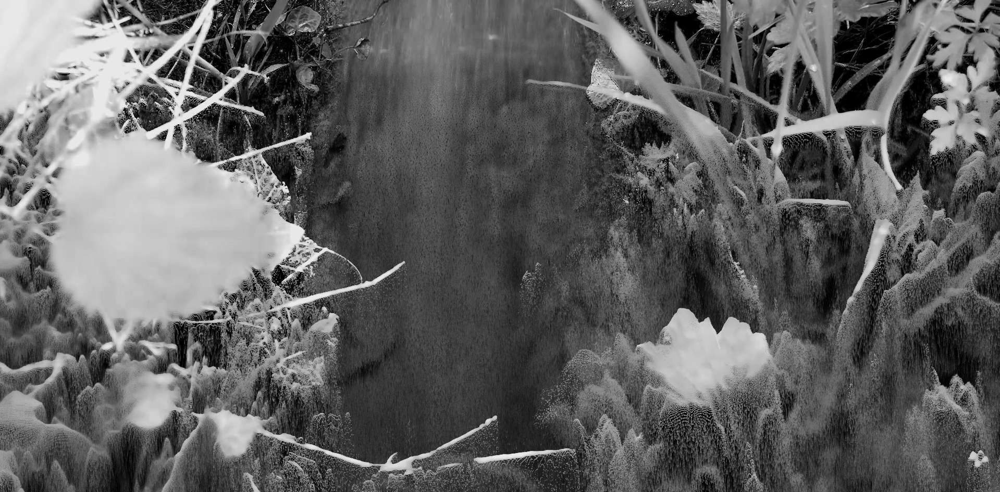

# La Symphonie de l'Environnement

**Context**: Le Broc Festival, Nice  
**When**: 2022  
**With**: Janine Huizenga, Andrew Bullen, Romina Romay, Helvia Briggen

Natural and technological worlds have been existing together for centuries. Only recently, however, we read an imbalance of powers between the two, leading to social crises and environmental catastrophes. Analysing and simulating natural, as well as mechanical, patterns in the French village of Le Broc, La Symphonie de l'Environnement speculates on the relationship between technology and nature of the future.

Premiered at the Théâtre de Verdure de Le Broc, La Symphonie de l'Environnement is a collaborative effort between the local villagers together with producers Andrew Bullen, Janine Huizenga, composer Romina Romay, harpist Helvia Briggen, and visual artist Leo Scarin.

<iframe width="100%" height="315" src="https://www.youtube.com/embed/pZxTwrtGydU?si=wWpZOLvc_b3PCyeE" title="YouTube video player" frameborder="0" allow="accelerometer; autoplay; clipboard-write; encrypted-media; gyroscope; picture-in-picture; web-share" referrerpolicy="strict-origin-when-cross-origin" allowfullscreen></iframe>