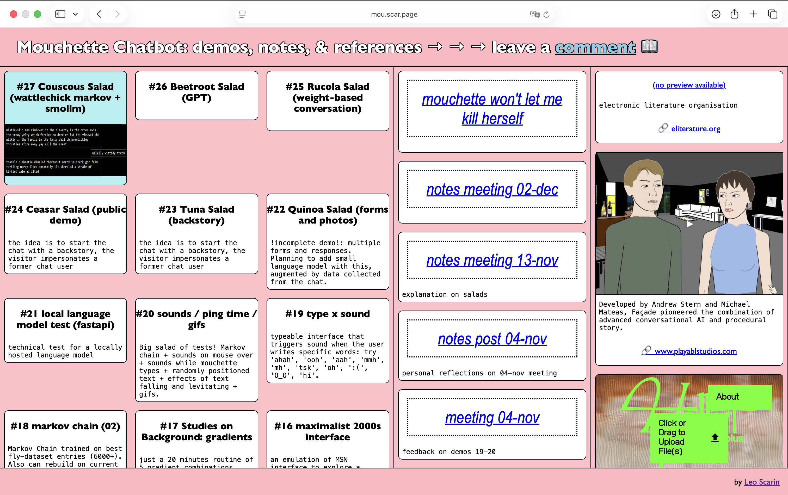
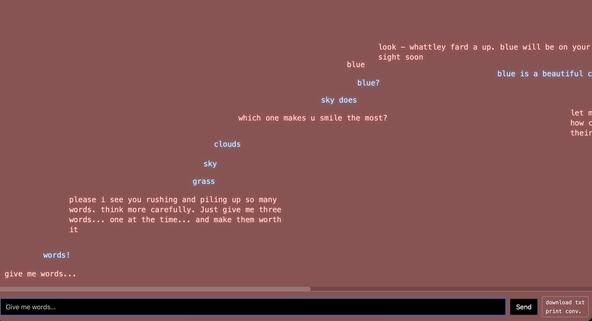

# Mouchette Chatbot

A custom made conversational bot as an extension of 30-year-old website mouchette.org

**When**: 2025 - ongoing  
**With**: [Martine Neddam](https://neddam.info) 
**Role**: Developer / Artist 
**Context**: [Vleeshal](https://www.vleeshal.nl), Middelburg  
**Link**: [mou.scar.page](https://mou.scar.page)

For Vleeshal's digital art program, artist [Martine Neddam](https://neddam.info) revisited her iconic 1990s net art project [mouchette.org](https://mouchette.org). This project by Martine Neddam is designed in collaboration with Leo Scarin and curated by Roeliena Aukema.

First launched in the late 1990s, mouchette.org invited users into dark, poetic, and provocative exchanges with a virtual persona. This new project extends her presence into the present through a conversational language model that embodies her distinctive voice and aesthetics.

## Mouchette
Mouchette.org ([wikipedia entry](https://en.wikipedia.org/wiki/Mouchette.org)) was created in 1996 by Neddam and consists of an interactive website that follows the story of a nearly thirteen-year-old girl named Mouchette (little fly in French). Loosely following the narrative from the original film from 1967 by Robert Bresson, visitors can navigate through the website and interact with the persona of Mouchette. What looks like a website built by a young girl, slowly starts unfolding in darker themes surrounding death, murder and suicide. Within this non-linear storyline, messages and emails by real-life visitors are also included.

Throughout the years, mouchette.org has been part of a larger framework in which Neddam investigates how identity and virtuality work online. Vleeshal commissioned her to research a new way of thinking about public interaction online, which led to the creation of the Mouchette Chatbot. Unlike conventional chatbots, the Mouchette chatbot integrates expressive visual and sonic elements that can also be found on the original website. The interface reacts to dialogue with shifting colors, animated typography, gifs, emojis, and ambient sounds, turning each exchange into a performed experience rather than a purely textual one, also highlighting the idea of performativity in the digital sphere.

Developed in collaboration with Leo Scarin, the project offers several live sessions in which the audience can participate and interact with this project. In addition to these sessions, you can also join the Mouchette newsletter for notes, photos, and sudden interactions. Visitors online will engage in live conversations with Mouchette, witnessing her return as a poetic, unpredictable, and intimate digital presence.

---

## Personal notes

<figure>

<figcaption>Martine and I meeting for the first time (we never saw each other's back!)</figcaption>
</figure>
