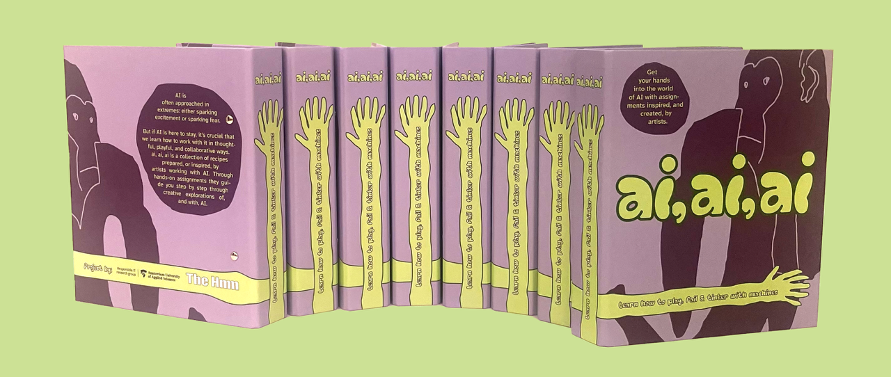
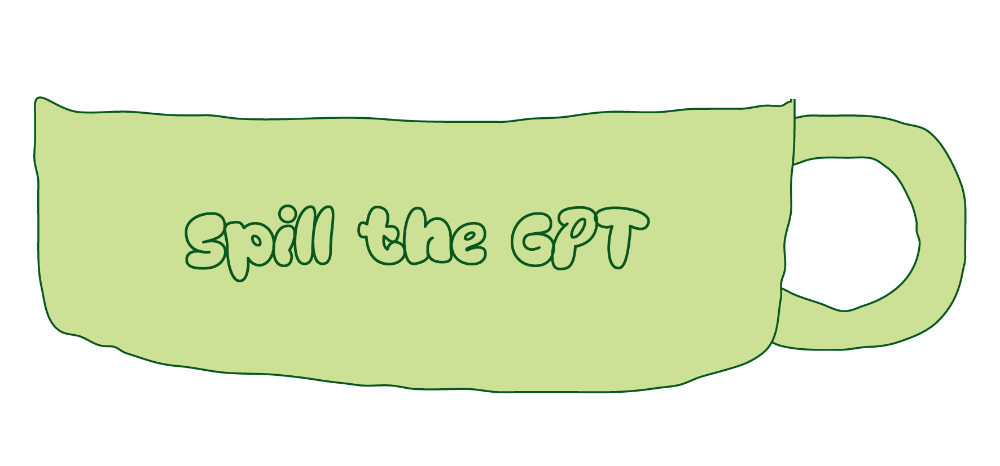

# Spill the GPT

A creative exercise in collecting and training a small gossip's language model

**When**: 2025  
**Type**: Publication
**Context**: [The Hmm](https://www.thehmm.nl)  
**Link**: [aiaiai.art/spill-the-gpt](https://aiaiai.art/spill-the-gpt) 

---

Part of **ai, ai, ai**, a book of creative assignments edited by The Hmm, **Spill the GPT** is an exercise in training your own language model.

## ai, ai, ai

ai, ai, ai is collaborative project of The Hmm, the Responsible IT research group at the Amsterdam University of Applied Sciences and artists and designers who work with AI. 

Our feeds are constantly bombarded with nonsense generated by Artificial Intelligence (AI). From Shrimp Jesus to muscular oranges to Chimpanzini Bananini. While these surreal brainrot figures are often dismissed as “AI slop,” their popularity shows something deeper: a new, collective language for making sense of the chaos and absurdity of digital life. On the surface, Italian brainrot characters may seem absurd, but they also open up possibilities to how AI tools can be used.

Rather than seeing AI in extremes—either sparking excitement or sparking fear—these playful creations remind us there are other ways of engaging with the technology. If AI is here to stay, it’s crucial that we learn how to work with it in thoughtful and collaborative ways. In order to encourage these new ways of working, we’ve created ai, ai, ai , a collection of recipes prepared, or inspired, by artists working with AI. This living publication and web project brings together hands-on assignments that guide you step by step through creative explorations of, and with, AI.

