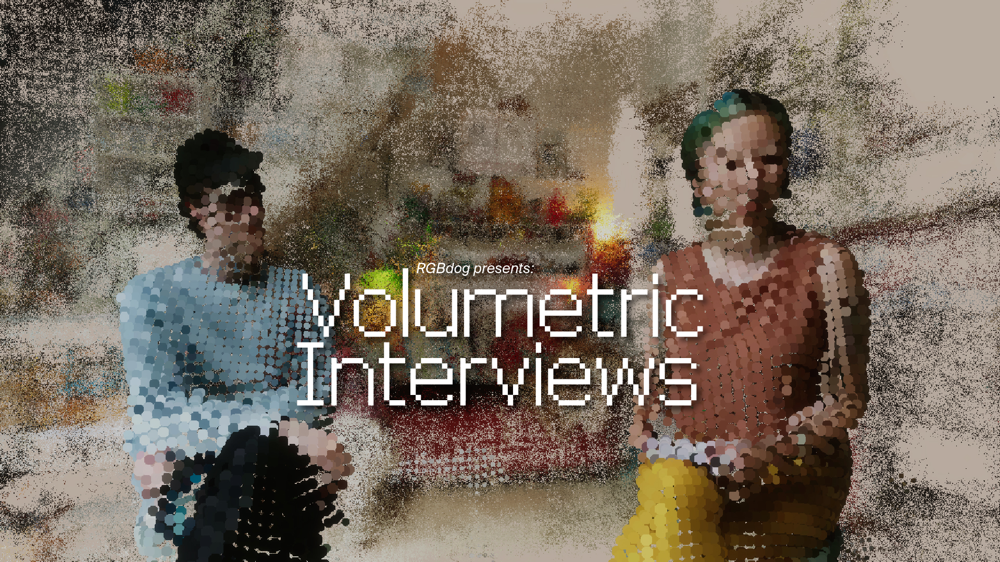

# Volumetric Interviews

An experimental documentary introducing studios that explore creative technology as a means to build communities

**Link**: [RGBdog presents: Volumetric Interviews](https://rgbdog.studio/projects/volumetric-interviews/)  
**With**: [RGBdog](https://rgbdog.studio)  
**When**: 2021-2024  
**Role**: VFX Developer  

**RGBdog Presents: Volumetric Interviews** introduces creatives based in The Netherlands working at the intersection of music, visual arts and technology, who are focused on developing supportive communities all over the world. The series aims to raise awareness of the creative possibilities of technology and to invite audiences in joining the ongoing broader debate about its benefits and pitfalls.

Seeking to push the boundaries of the disciplines of photography, design, and autonomous arts, Volumetric Interviews resorts to a combination of traditional filmmaking and volumetric image capturing techniques! With this experimentation, the series invites the audience to the virtual world where the story takes place.

<iframe width="100%" height="315" src="https://www.youtube.com/embed/o_MjZGsWIqY?si=pqPvVMLDecL6XAVp" title="YouTube video player" frameborder="0" allow="accelerometer; autoplay; clipboard-write; encrypted-media; gyroscope; picture-in-picture; web-share" referrerpolicy="strict-origin-when-cross-origin" allowfullscreen></iframe>